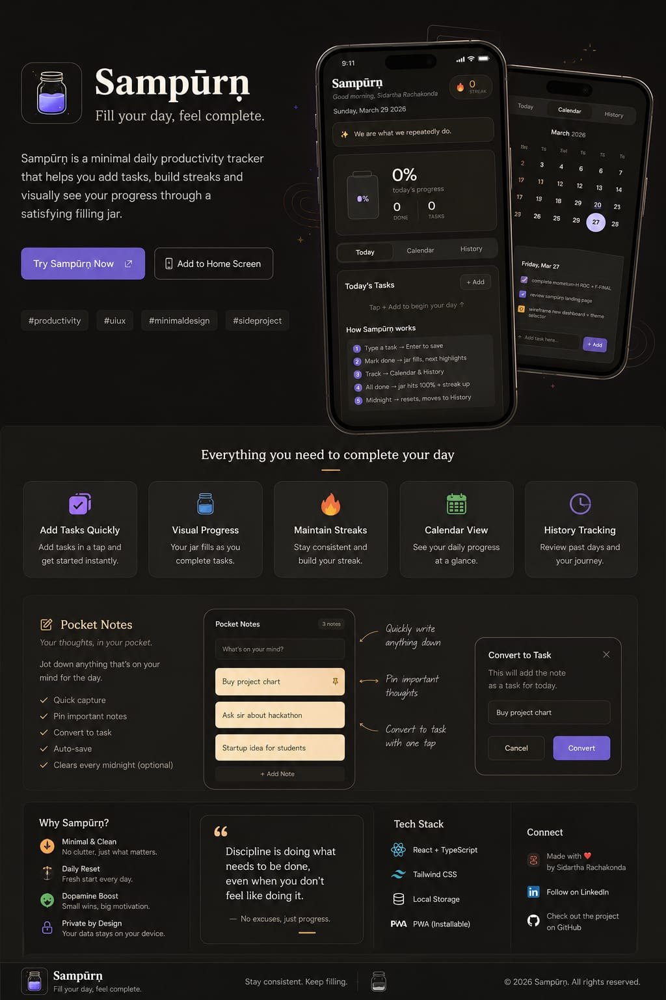

# 🫙 Sampūrṇ  
### *Fill your day, feel complete.*

Sampūrṇ is a minimal productivity web application designed to make consistency feel simple, visual, and satisfying.

Instead of overwhelming users with complicated productivity systems, Sampūrṇ focuses on a calm, distraction-free experience where users can:
- add daily tasks quickly
- track progress visually through a filling jar
- maintain streaks
- store random thoughts using Pocket Notes
- review progress using Calendar & History

---

# ✨ Live Demo

🔗 https://sampurn1.netlify.app/

---

# 🖼️ Preview

## Main Experience

---

## 📝 Pocket Notes — New Feature Launch

---

# 🌟 Features

## ✅ Daily Task Tracking
- Add tasks instantly
- Smart emoji matching
- One-click completion
- Smooth minimal interactions

---

## 🫙 Visual Jar Progress
The jar fills as tasks are completed, creating a small dopamine boost and encouraging consistency through visual satisfaction.

---

## 🔥 Streak System
Maintain daily streaks and stay consistent over time.

---

## 📅 Calendar View
Track daily productivity using color-coded calendar indicators.

---

## 🕘 History Tracking
Review previous days and monitor progress over time.

---

# 📝 Pocket Notes

Pocket Notes is a floating minimal notepad built directly into Sampūrṇ.

It allows users to:
- save random thoughts
- capture ideas instantly
- write quotes & plans
- maintain brain dumps
- store temporary thoughts

---

## ✨ Pocket Notes Features

- Floating popup notepad
- Glass blur background
- Auto-save while typing
- Day-wise note storage
- Instant search functionality
- Timestamp-based memory feel
- Minimal distraction-free design

---

## 🔍 Smart Search

Users can instantly search previously saved notes.

Search results include:
- note content
- saved date
- timestamps

This creates a more personal “memory-like” experience instead of plain notes storage.

---

# 🎯 Design Philosophy

Sampūrṇ is not built to be another overloaded productivity tool.

The goal is to create:

> “A calm personal productivity space that feels satisfying to use every day.”

The entire experience focuses on:
- minimalism
- reduced friction
- visual motivation
- smooth UX
- emotional satisfaction

---

# 🛠️ Tech Stack

- HTML
- CSS
- JavaScript
- Firebase Authentication
- Firestore Database
- Netlify

---

# 🔐 Security

- Firebase Authentication enabled
- Firestore protected with security rules
- API key restricted to allowed domains

---

# 🚀 Upcoming Features

- 🎤 Voice Input for tasks & notes
- 🌙 Daily Reflection
- 📊 Weekly Productivity Recap
- ⏳ Focus Sessions
- 🧠 AI-based productivity insights

---

# 📱 PWA Support

Sampūrṇ can be installed as a Progressive Web App (PWA).

You can:
- Add it to your Home Screen
- Use it like a native app
- Access it quickly anytime

---

# 💡 Why “Sampūrṇ”?

“Sampūrṇ” means:
> *Complete / Whole*

The idea behind the app is simple:
small consistent actions slowly make your day feel complete.

---

# 👨‍💻 Developer

Built with ❤️ by **Sidhartha Ray**

---

# ⭐ Support

If you liked the project:
- Give it a ⭐ on GitHub
- Share feedback
- Connect on LinkedIn

---

# 📜 License

This project is licensed under the MIT License.
